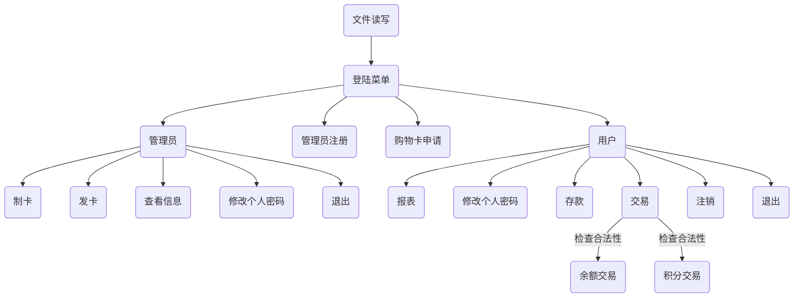

```mermaid
graph TB
	file(文件读写)-->main(登陆菜单)
	main-->admin(管理员)
	main-->admsign(管理员注册)
	main-->apply(购物卡申请)
	main-->user(用户)
	admin-->make(制卡)
	admin-->send(发卡)
	admin-->look1(查看信息)
	admin-->modify1(修改个人密码)
	admin-->quit1(退出)
	user-->look2(报表)
	user-->modify2(修改个人密码)
	user-->save(存款)
	user-->pay(交易)
	pay--检查合法性-->money(余额交易)
	pay--检查合法性-->score(积分交易)
	user-->delete(注销)
	user-->quit2(退出)
```

